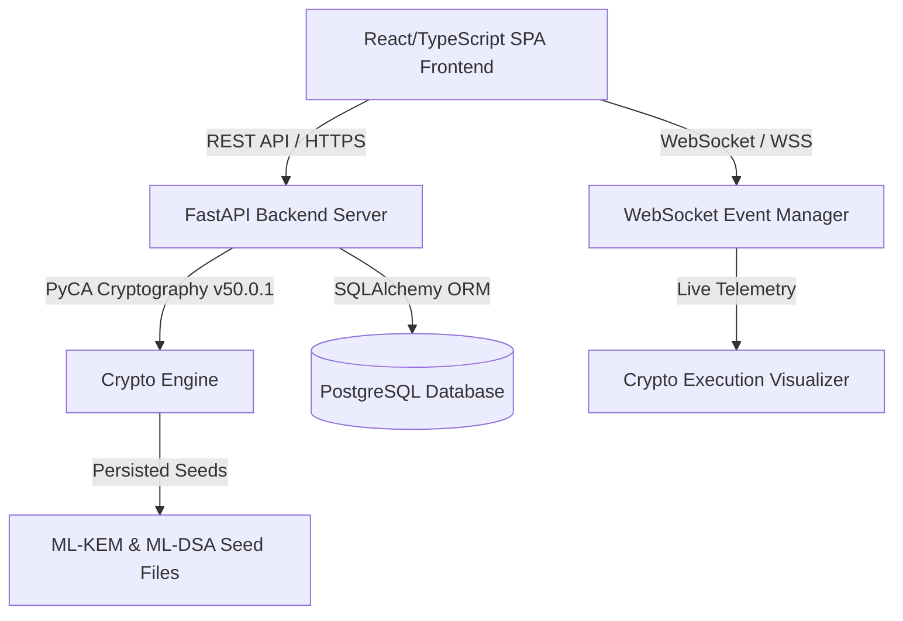
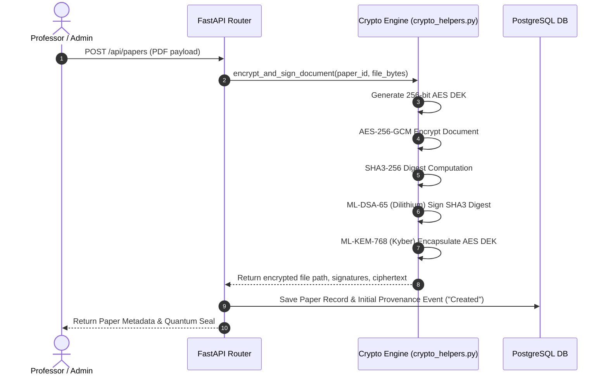
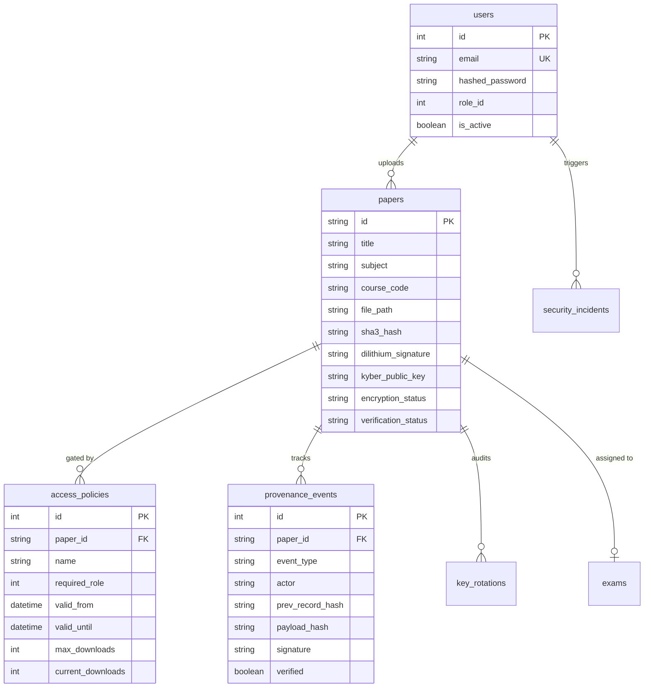

# QuantumShield System Architecture

QuantumShield is an enterprise-grade academic paper distribution platform engineered with post-quantum cryptography (PQC). It mitigates Harvest-Now-Decrypt-Later (HNDL) threats using NIST-standardized quantum-resistant algorithms alongside Zero-Trust fine-grained access control policy engines and immutable event provenance chains.

---

## 1. System Overview & Component Layout

### Frontend Architecture (`quantum-shield/src/`)
- **UI Framework**: React 18 + TypeScript built with Vite.
- **Styling**: Tailwind CSS with custom dark mode themes and glassmorphic UI cards.
- **Routing**: React Router v6 with AuthGuard wrappers.
- **Interactive Visualizers**:
  - `CryptoVisualizer.tsx`: 3-level live execution trace (Overview Feed, Animated Pipeline Flow Diagram, Technical Microsecond Telemetry).
  - `AESSandbox.tsx`: Interactive client-side AES-128 round-by-round visualizer verified against NIST FIPS-197 Appendix B.
  - `AccessPolicies.tsx`: Zero-trust access policy editor with role, time-window, and quota enforcement.
  - `ExamDashboard.tsx`: High-security examination state machine controller (`created` → `locked` → `released` → `closed`).
  - `ThreatCenter.tsx`: Dynamic threat dashboard featuring behavior profiles, anomaly scores, and key compromise dry-run blast radius simulation.

### Backend Architecture (`backend/app/`)
- **API Engine**: FastAPI running on Python 3.14 / Uvicorn.
- **Database**: PostgreSQL hosted on WSL Ubuntu, managed via SQLAlchemy ORM and Alembic migrations.
- **Security & Auth**: OAuth2 Password bearer flow using JWT tokens (`HS256`) and `bcrypt` password hashing. `slowapi` rate-limiting protects `/api/login` (10 requests/min).
- **Crypto Engine (`crypto_helpers.py`)**: Uses PyCA `cryptography` v50.0.1 for native C-bindings of FIPS-standard PQC primitives.

---

## 2. Cryptographic Execution Flow

---

## 3. Database Schema & Data Models

---

## 4. Key Security Boundaries
1. **Zero Raw Secret Key Exposure**: Server private seeds (`server_mldsa_seed.bin` and `system_mlkem_seed.bin`) remain locked on backend disk; raw secret key bytes are never sent in API responses or WebSocket broadcasts.
2. **Gated Key Release**: Decryption keys are NEVER stored static on disk. AES DEKs exist only as ephemeral encapsulated keypairs inside `ML-KEM-768` ciphertexts, decapsulated only when policy engines authorize release.
3. **Immutable Provenance Chains**: Every paper modification or download registers a SHA3-linked `ProvenanceEvent` record, preventing non-repudiable audit tampering.
