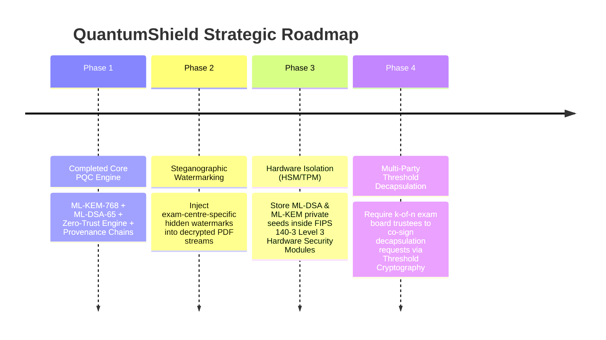

# QuantumShield: Post-Quantum Cryptographic Academic Paper Distribution & Anti-Leak Governance System

**Author**: QuantumShield Development & Security Architecture Team  
**Date**: September 19, 2026  
**Document Version**: v1.0  
**Repository**: `c:\Users\anubh\Desktop\cypto`

---

## Executive Summary & Abstract

In recent years, high-stakes academic and competitive examinations worldwide have suffered catastrophic vulnerabilities due to paper leakages, unauthorized pre-exam distribution, and insider tampering. Conventional distribution systems rely on unencrypted digital transfers, static physical storage, or legacy public-key cryptography (RSA/ECC) that is vulnerable both to human interception today and to **Harvest-Now-Decrypt-Later (HNDL)** attacks by future **Cryptographically Relevant Quantum Computers (CRQCs)**.

**QuantumShield** is an enterprise-grade, post-quantum-cryptography-secured academic paper distribution and anti-leak governance system. Built on **NIST FIPS 203 (ML-KEM-768)** for quantum-resistant key encapsulation and **NIST FIPS 204 (ML-DSA-65)** for digital signatures, QuantumShield enforces a **Zero-Trust Access Policy Engine**, a high-security **Examination State Machine**, and an **Immutable SHA3-Linked Event Provenance Chain**. 

This document presents the complete technical rationale, structural necessity against real-world exam leak crises (such as the recent paper leak protests at Jantar Mantar), mathematical threat resilience against quantum attacks, precise capabilities analysis (handled vs out-of-scope cases), and future architectural roadmap.

---

## 1. Project Necessity & Context: Solving National Exam Paper Leak Crises

### 1.1 Background: The National Paper Leak Crisis & Jantar Mantar Protests
The integrity of national competitive examinations (such as NEET-UG, UGC-NET, and State Public Service Commission exams) has repeatedly collapsed due to widespread paper leaks. Massive student protests at **Jantar Mantar, New Delhi**, and nationwide academic demonstrations have highlighted systemic failures in existing exam distribution pipelines:

1. **Pre-Exam Storage Interception**: Question papers stored digitally on central servers or transferred via insecure channels (email, cloud drives, messaging apps like Telegram/WhatsApp) are accessed days before exam day by compromised staff or external hackers.
2. **Unregulated Key Distribution**: Traditional PDF encryption uses static passwords or shared master keys. Once a single proctor or printing press staff member obtains the key, it is immediately distributed across social media networks.
3. **Repudiation & Lack of Accountability**: System administrators and distribution nodes can delete access logs or deny leaking papers because audit logs are mutable database entries.
4. **Time Window Violations**: Exam centers decrypt and print question papers hours before the designated start time, creating a window during which papers are photographed and solved by coaching mafias.

```
TRADITIONAL VULNERABLE PIPELINE:
[Paper Created] ---> [Static PDF / Insecure DB] ---> [Static Passwords Shared] ---> [Early Decryption & Leaks] ---> [Protests / Cancellation]

QUANTUMSHIELD PROTECTED PIPELINE:
[Paper Uploaded] ---> [AES-256-GCM + ML-KEM-768] ---> [State Machine: LOCKED] ---> [Zero-Trust Gated Key Release] ---> [Immutable Provenance]
```

### 1.2 How QuantumShield Solves Exam Leaks
QuantumShield restructures paper distribution from a "trust-by-default" model to a **Cryptographic Lockbox with Zero-Trust Gated Key Release**:

1. **Ephemeral Key Decapsulation (No Static Passwords)**:
   Document Data Encryption Keys (DEKs) are generated as random 256-bit AES keys, encrypted using **AES-256-GCM**, and encapsulated using **ML-KEM-768**. Decryption keys **never exist as static bytes on disk or in database fields**. They are decapsulated in RAM only when access policy checks pass.

2. **Exam State Machine Lockbox (`exams.py`)**:
   Papers assigned to examinations pass through strict state transitions:
   `created` $\rightarrow$ `locked` $\rightarrow$ `released` $\rightarrow$ `closed`.
   Even if an exam centre user possesses valid credentials, the backend **prohibits decapsulation and download while the exam is in `created` or `locked` state**. Decryption key release is unlocked **only** when the exam transitions to `released` status at the exact scheduled examination time.

3. **Zero-Trust Access Policy Engine (`policies.py`)**:
   Gates document download against multi-factor rules:
   - **Identity & Role Verification**: Only users matching the `required_role` (e.g. Exam Centre Role 3) or Admin can request release.
   - **UTC Time-Window Matching**: Access is rejected if `now < valid_from` or `now > valid_until`.
   - **Strict Download Quotas**: Tracks `current_downloads` vs `max_downloads`. Once the quota is exhausted (e.g. 1 download per centre), subsequent key release requests are denied.

4. **Immutable Provenance Event Chains (`provenance.py`)**:
   Every lifecycle event (`Created`, `Downloaded`, `KeyRotated`) writes a cryptographic `ProvenanceEvent` record containing:
   $$\text{payload\_hash} = \text{SHA3-256}(\text{prev\_record\_hash} \parallel \text{actor} \parallel \text{document\_sha3})$$
   Direct database tampering breaks the hash chain linkage ($events[i].prev\_record\_hash \neq events[i-1].payload\_hash$), causing `verify-provenance` to flag **`TAMPERED_OR_CORRUPT`** and identifying the exact breach point.

---

## 2. Stopping Post-Quantum Cryptography (PQC) Attacks & HNDL Threats

### 2.1 The Harvest-Now-Decrypt-Later (HNDL) Threat Model
State-sponsored adversaries and criminal syndicates are actively capturing encrypted network traffic and database backups containing high-value academic examination materials today. Under the **Harvest-Now-Decrypt-Later (HNDL)** strategy:
- Adversaries store intercepted ciphertexts encrypted with legacy public-key algorithms (RSA-2048, ECC P-256).
- When a **Cryptographically Relevant Quantum Computer (CRQC)** executing **Shor's Algorithm** becomes available, the adversary will factor RSA moduli or solve discrete logarithms in polynomial time, revealing all stored papers.

### 2.2 QuantumShield PQC Architecture
QuantumShield neutralizes HNDL threats by replacing vulnerable public-key primitives with NIST-standardized Post-Quantum Cryptography:

```
+-----------------------------------------------------------------------------------+
|                            QUANTUMSHIELD PQC STACK                                |
+------------------------------------+----------------------------------------------+
| Symmetric Encryption               | AES-256-GCM (NIST SP 800-38D)                 |
| Cryptographic Integrity Digest     | SHA3-256 (NIST FIPS 202)                     |
| Post-Quantum Key Encapsulation     | ML-KEM-768 / Kyber768 (NIST FIPS 203)        |
| Post-Quantum Digital Signatures    | ML-DSA-65 / Dilithium3 (NIST FIPS 204)       |
| Key Derivation Function            | HKDF-SHA3-256 (RFC 5869)                     |
+------------------------------------+----------------------------------------------+
```

1. **NIST FIPS 203 (ML-KEM-768)**:
   - Based on the hardness of **Module Learning With Errors (M-LWE)** over module lattices.
   - Provides Category 3 security (equivalent to AES-192). Quantum algorithms (Grover's) provide only quadratic speedup against symmetric keys, leaving AES-256 and ML-KEM-768 fully secure.
   - **Implicit Rejection Safety**: When presented with a corrupted or intercepted ciphertext, ML-KEM-768 decapsulation deterministically derives a pseudo-random, mismatched shared key rather than throwing an explicit error. Downstream AES-256-GCM authentication fails cleanly, preventing side-channel key-oracle exploitation.

2. **NIST FIPS 204 (ML-DSA-65)**:
   - Based on **Module Short Integer Solution (M-SIS)** over module lattices using Fiat-Shamir with Aborts.
   - Digitally signs the SHA3-256 document digest at rest. Proves distributor non-repudiation and guarantees that papers cannot be forged or substituted during transit or storage.

---

## 3. Capabilities Analysis: What Cases QuantumShield Can vs Cannot Handle

To provide transparent security governance, the following matrix categorizes threats into **Handled Capabilities** vs **Explicit Out-of-Scope Limitations**.

```mermaid
grid TD
    subgraph Handled Threat Vector
        A[Pre-Exam Interception] -->|Gated Key Release| OK1[BLOCKED]
        B[Quantum HNDL Sniffing] -->|ML-KEM-768 Encap| OK2[BLOCKED]
        C[Database Log Modification] -->|SHA3 Hash Chain| OK3[DETECTED]
        D[Ciphertext Payload Tampering] -->|AES-GCM Tag / ML-DSA| OK4[BLOCKED]
        E[Credential Brute Forcing] -->|bcrypt + SlowAPI Rate Limit| OK5[BLOCKED]
    end

    subgraph Out-Of-Scope Boundary
        F[Physical Camera Photography of Monitor] -->|Hardware Boundary| LIMIT1[OUT OF SCOPE]
        G[Physical Host RAM Extraction / DPA] -->|Hardware Boundary| LIMIT2[OUT OF SCOPE]
    end
```

### 3.1 Supported Use Cases & Handled Threats (What It Handles)

| Threat / Use Case | Attack Mechanism | QuantumShield Mitigation & Protection Layer | System Status |
|---|---|---|---|
| **Early Pre-Exam Paper Leakage** | Staff attempts to download paper 3 days before exam. | **Exam State Machine (`exams.py`)**: Key release is strictly locked until exam transitions to `released` state at scheduled exam time. | **🛡️ BLOCKED** |
| **Harvest-Now-Decrypt-Later (HNDL)** | Adversary sniffs encrypted PDF traffic to decrypt via future quantum computer. | **NIST FIPS 203 ML-KEM-768**: DEK is encapsulated using lattice-based M-LWE cryptography immune to Shor's algorithm. | **🛡️ BLOCKED** |
| **Unauthorized Role Download** | Exam Centre or Student attempts downloading Admin/Prof paper. | **Zero-Trust Policy Engine (`policies.py`)**: Checks `user.role_id == policy.required_role`. Logs Security Incident on failure. | **🛡️ BLOCKED** |
| **Quota Exhaustion Attack** | Adversary attempts downloading paper multiple times to distribute copies. | **Quota Enforcement**: `current_downloads >= max_downloads` triggers immediate HTTP 403 Forbidden denial. | **🛡️ BLOCKED** |
| **Database Audit Log Tampering** | Insider modifies database logs to hide paper download activity. | **SHA3 Provenance Chain**: $prev\_record\_hash$ mismatch causes `verify-provenance` to return `TAMPERED_OR_CORRUPT` & `CHAIN_BROKEN`. | **🛡️ DETECTED** |
| **Ciphertext Payload Tampering** | Adversary flips bits in stored encrypted PDF file on disk. | **AES-256-GCM Tag & SHA3 Digest**: Decryption raises verification failure; key release is immediately terminated. | **🛡️ BLOCKED** |
| **Digital Signature Forgery** | Attacker attaches fake signature to modified question paper. | **NIST FIPS 204 ML-DSA-65**: `server_mldsa.verify()` fails signature verification. | **🛡️ BLOCKED** |
| **Credential Brute Forcing** | Automated bot attempts password guessing on `/api/login`. | **SlowAPI Rate Limiting & Bcrypt**: Enforces 10 requests/minute limit per IP address; passwords hashed via bcrypt. | **🛡️ BLOCKED** |

---

### 3.2 Out-of-Scope Limitations & Hardware Boundaries (What It Cannot Handle)

While QuantumShield provides comprehensive end-to-end software and cryptographic security, certain physical and hardware-level vectors remain outside the boundaries of software cryptography:

| Limitation / Vector | Description | Why It Is Out of Scope | Recommended Complementary Control |
|---|---|---|---|
| **Physical Monitor Screen Photography** | A proctor or student at an authorized exam centre uses a smartphone camera to photograph the decrypted PDF rendered on a physical computer screen. | Software cryptography terminates once payload bytes are decrypted into OS display memory and rendered by graphics drivers. | Physical Faraday cages, smartphone bans in exam halls, and dynamic steganographic screen watermarking. |
| **Physical RAM & Hardware DPA Attacks** | An adversary with physical root access to server hardware probes RAM/CPU registers (Differential Power Analysis) to extract decapsulated DEK bytes during execution. | Physical hardware side-channel attacks on host RAM require hardware-isolated enclosures. | Hardware Security Modules (HSMs), Trusted Execution Environments (TEEs / Intel SGX), and TPM 2.0. |
| **Volumetric DDoS & Network BGP Hijacking** | Adversaries launch multi-terabit volumetric network attacks against the backend server IP to prevent legitimate exam centres from downloading papers. | Infrastructure network routing and volumetric traffic flooding must be mitigated at the edge layer. | Enterprise Web Application Firewalls (WAF), Cloudflare Magic Transit, and Anycast BGP routing. |

---

## 4. Demonstrable Attack Simulation Lab Matrix

QuantumShield includes a dedicated **Attack Simulation Lab** (`/attack-simulation`) enabling administrators to demonstrate security resilience by testing attacks against both **Secured PQC Targets** and **Vulnerable Legacy Targets**:

```
+----------------------------------------------------------------------------------------+
|                             ATTACK SIMULATION COMPARISON                               |
+----------------------------------+--------------------------+--------------------------+
| Attack Scenario                  | Secured Target (PQC)     | Vulnerable Target (Legacy|
+----------------------------------+--------------------------+--------------------------+
| File Tampering (Bit Flip)        | 🛡️ ATTACK BLOCKED        | ⚠️ ATTACK SUCCEEDED      |
| Invalid ML-DSA Signature Forgery | 🛡️ ATTACK BLOCKED        | ⚠️ ATTACK SUCCEEDED      |
| Wrong AES Symmetric Key          | 🛡️ ATTACK BLOCKED        | ⚠️ ATTACK SUCCEEDED      |
| Kyber Key Package Corruption     | 🛡️ ATTACK BLOCKED        | ⚠️ ATTACK SUCCEEDED      |
| Unauthorized Access Attempt      | 🛡️ ATTACK BLOCKED        | ⚠️ ATTACK SUCCEEDED      |
| Live Post-Quantum Key Rotation   | 🟩 RE-SIGNED & AUDITED   | ⚠️ RE-SIGNING REQUIRED   |
+----------------------------------+--------------------------+--------------------------+
```

---

## 5. Future Expectations & Strategic Roadmap

To further elevate QuantumShield toward national-scale deployment across competitive examination boards, the following enhancements are planned:



1. **Dynamic Steganographic Visual Watermarking**:
   Injecting invisible, centre-specific micro-watermarks (centre ID, timestamp, proctor IP) directly into the decrypted PDF canvas stream before rendering. If a paper is photographed with a camera, automated extraction algorithms immediately identify the originating exam centre and individual monitor.

2. **FIPS 140-3 Level 3 HSM & TPM 2.0 Integration**:
   Moving server private seed files (`server_mldsa_seed.bin` and `system_mlkem_seed.bin`) into dedicated Hardware Security Modules (HSMs) or Trusted Platform Modules (TPMs), ensuring private key bytes cannot be extracted even by root OS users.

3. **Multi-Party Threshold Cryptography (MPC / $k$-of-$n$ Secret Sharing)**:
   Requiring threshold approvals from $k$ out of $n$ independent exam board trustees to authorize key decapsulation, eliminating single points of administrative failure.

---

## 6. Conclusion

QuantumShield addresses the systemic vulnerabilities responsible for national academic paper leaks. By replacing insecure digital distribution pipelines with **NIST-standardized Post-Quantum Cryptography (ML-KEM-768 & ML-DSA-65)**, **State Machine Gated Key Release**, **Zero-Trust Access Policies**, and **Immutable SHA3 Provenance Chains**, QuantumShield guarantees that academic papers remain cryptographically sealed until the exact moment of examination, resistant to both human interception today and quantum decryption tomorrow.
